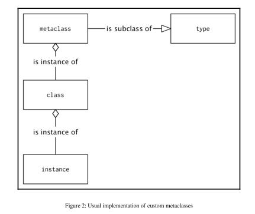

# Metaclass is a type

  

  
  
## The general syntax of metaclass

``` Python
def method(self):
  return 1
  
MyClass = type('MyClass', (object,), {'method': method})

# This is equivalent to defination following

class MyClass:
    def method(self):
        return 1

```

###  Change metaclass by providing a metaclass keyword argument

``` Python
class ClassWithAMetaclass(metaclass=type):
    pass
```

**The value that's provided as a  metaclass argument is usually another class object, but it
can be any other callable that accepts the same arguments as the  type class and is expected
to return another class object.**

#### The type call signature 

> type(name, bases, namespace)

  * **name** : This is the name of the class that will be stored in the  \_\_name\_\_ attribute
  
  * **bases** : This is the list of parent classes that will become the  \_\_bases\_\_ attribute
    and will be used to construct the MRO of a newly created class
  
  * **namespace** : This is a namespace (mapping) with definitions for the class body
    that will become the  \_\_dict\_\_ attribute

####  Use a different class that inherits from  type

``` Python
# The common template for a metaclass 
class Metaclass(type):
    def __new__(mcs, name, bases, namespace):
       return super().__new__(mcs, name, bases, namespace)
       
    @classmethod
    def __prepare__(mcs, name, bases, **kwargs):
        return super().__prepare__(name, bases, **kwargs)
        
    def __init__(cls, name, bases, namespace, **kwargs):
        super().__init__(name, bases, namespace)
        
    def __call__(cls, *args, **kwargs):
        return super().__call__(*args, **kwargs)
```

  * **\_\_new\_\_(mcs, name, bases, namespace)** : This is responsible for the actual
    creation of the class object in the same way as it does for ordinary classes. The
    first positional argument is a metaclass object. In the preceding example, it would
    simply be a  Metaclass . Note that  mcs is the popular naming convention for this
    argument.
  
  * **\_\_prepare\_\_(mcs, name, bases, \*\*kwargs)** : This creates an empty
    namespace object. By default, it returns an empty  dict , but it can be overridden
    to return any other mapping type. Note that it does not accept  namespace as an
    argument because, before calling it, the namespace does not exist. Example usage
    of that method will be explained later in the New Python 3 syntax for metaclasses
    section.
  
  * **\_\_init\_\_(cls, name, bases, namespace, \*\*kwargs)** : This is not seen
    popularly in metaclass implementations but has the same meaning as in ordinary
    classes. It can perform additional class object initialization once it is created
    with  \_\_new\_\_() . The first positional argument is now named  cls by convention
    to mark that this is already a created class object (metaclass instance) and not a
    metaclass object. When  \_\_init\_\_() was called, the class was already
    constructed and so this method can do less things than the  \_\_new\_\_() method.
    Implementing such a method is very similar to using class decorators, but the
    main difference is that  \_\_init\_\_() will be called for every subclass, while class
    decorators are not called for subclasses.
  
  * **\_\_call\_\_(cls, \*args, \*\*kwargs)** : This is called when an instance of a
    metaclass is called. The instance of a metaclass is a class object (refer to Figure 1);
    it is invoked when you create new instances of a class. This can be used to
    override the default way of how class instances are created and initialized.
    
  ** \*\*kwargs :These arguments can be passed to the metaclass objectusing extra keyword arguments in the class definition in the form of the following code:
    ``` Python
    class Klass(metaclass=Metaclass, extra="value"):
        pass
    ```
## An example usage of metaclass with some print() calls

``` Python
class RevealingMeta(type):
    def __new__(mcs, name, bases, namespace, **kwargs):
        print(mcs, "__new__ called")
        return super().__new__(mcs, name, bases, namespace)
        
    @classmethod
    def __prepare__(mcs, name, bases, **kwargs):
        print(mcs, "__prepare__ called")
        return super().__prepare__(name, bases, **kwargs)
        
    def __init__(cls, name, bases, namespace, **kwargs):
        print(cls, "__init__ called")
        super().__init__(name, bases, namespace)
        
    def __call__(cls, *args, **kwargs):
        print(cls, "__call__ called")
        return super().__call__(*args, **kwargs)
        
>>> class RevealingClass(metaclass=RevealingMeta):
...     def __new__(cls):
...         print(cls, "__new__ called")
...         return super().__new__(cls)
...     def __init__(self):
...         print(self, "__init__ called")
...         super().__init__()
...
<class 'RevealingMeta'> __prepare__ called
<class 'RevealingMeta'> __new__ called
<class 'RevealingClass'> __init__ called
>>> instance = RevealingClass()
<class 'RevealingClass'> __call__ called 
<class 'RevealingClass'> __new__ called 
<RevealingClass object at 0x1032b9fd0> __init__ called
```

## New Python3 syntax for metaclass

## Metaclass usage

**Frameworks are the place where metaclasses really shine**

## Metaclass pitfalls

unittest.mock.Mock


